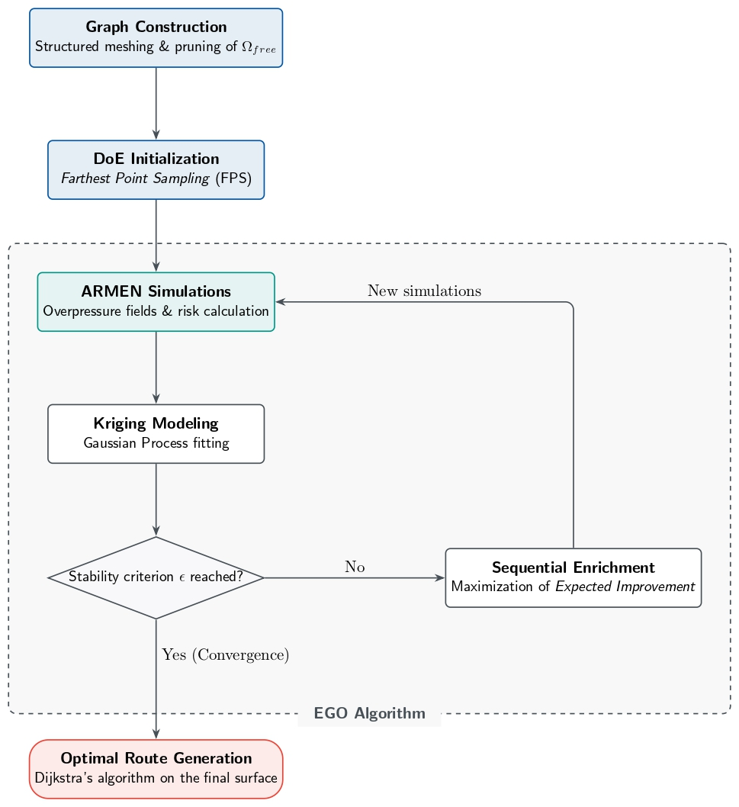
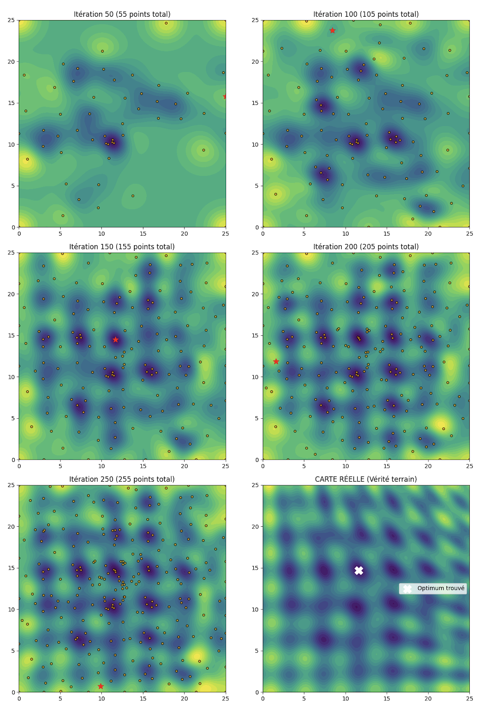
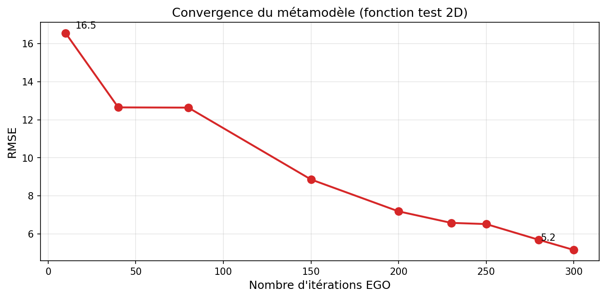
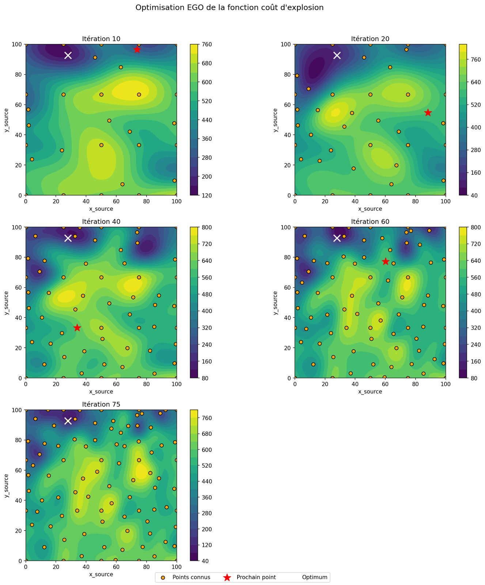
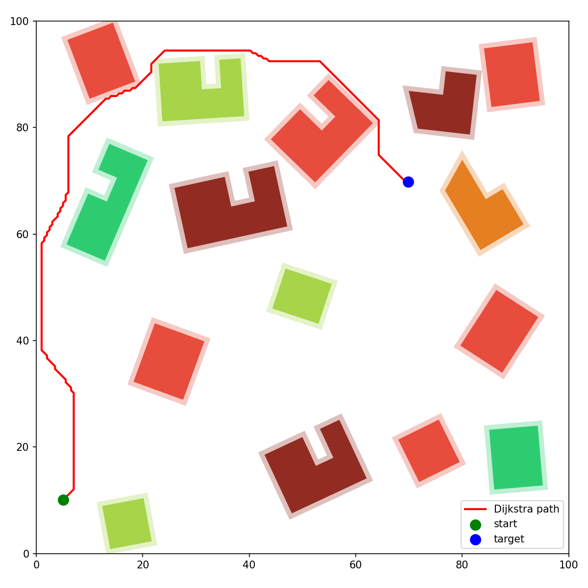

# Surrogate-Assisted Route Optimization for Explosive Ordnance Transport in Urban Environments

<p align="center">
  <strong>CentraleSupélec (Paris-Saclay) × CEA DAM</strong><br>
  HPC & Bayesian Optimization · Feb.–Apr. 2026
</p>

<p align="center">
  <a href="report/Rapport_Projet_ST7.pdf">📄 Full Report (FR)</a> ·
  <a href="#method">Method</a> ·
  <a href="#results">Results</a>
</p>

---

## TL;DR

We solve a safety-critical path-planning problem — transporting unstable WWII-era explosive ordnance through a dense urban environment — by combining **Gaussian Process surrogate modeling (Kriging)** with **Efficient Global Optimization (EGO)**. The surrogate approximates an expensive blast-damage cost function (full shock-wave simulation per point), reducing the required number of physics evaluations by an order of magnitude while producing a provably risk-minimizing route. The pipeline runs on the **CEA supercomputer** with MPI-parallelized simulations and batch-sequential infill via the Constant Liar heuristic.

---

## Problem Statement

When unexploded ordnance is discovered in an urban zone, it must be transported to a safe disposal site along a route that **minimizes cumulative damage risk** to surrounding infrastructure. The risk at any point depends on the blast overpressure field (governed by the Friedlander equation), the spatial distribution of buildings, and their strategic criticality (hospitals, schools, residential, industrial).

The core computational challenge: evaluating the risk at a single candidate explosion point requires a **full 2D/3D blast-wave simulation** (CEA's ARMEN solver), with runtimes of 45 s–5 min per point depending on mesh resolution. Exhaustive evaluation over a city-scale grid with thousands of nodes is intractable under the operational constraint of **< 24 h total compute time**.

**Objective.** Find $\gamma^* = \operatorname{argmin} J(\gamma)$ over all admissible paths, where:

$$J(\gamma) = \int_{\gamma} R(x)\,\mathrm{d}x \;+\; \int_0^1 g\!\left(z'(t)\right)\mathrm{d}t$$

- $R(x) = \sum_{i \in \mathcal{B}} D_i \cdot e^{\alpha \cdot K_i}$ — cumulative building damage. $D_i \in [0,1]$ is the destruction ratio (fraction of façade area exposed to overpressure $> 140\,\text{mbar}$), $K_i \in \{1,\dots,5\}$ is the building criticality category, and $\alpha$ controls the penalty scaling.
- $g(z'(t))$ — altitude-variation penalty (abrupt vertical movement increases detonation risk).

---

## Method



### 1 — Domain Discretization

The navigable space $\Omega_{\text{free}} = \Omega \setminus O$ (city minus buildings with 0.5 m buffer) is discretized into a weighted graph $G = (V, E)$ using a structured grid with 8-connectivity (cardinal + diagonal edges), projected onto 3D terrain. Edge weights approximate the continuous cost functional via midpoint quadrature of $R(x)$ and finite-difference evaluation of the altitude penalty.

### 2 — Design of Experiments: Farthest Point Sampling

The initial simulation budget ($n_0$ points) is allocated via **Farthest Point Sampling (FPS)**: iteratively select the node maximizing its geodesic distance to the nearest already-selected node. We benchmarked FPS against three alternatives:

| Method | Criterion | Complexity | Limitation |
|---|---|---|---|
| Greedy dominating set | Coverage ($k$-domination) | $O(n^2)$ | Irregular spacing, order-dependent |
| K-means | Cluster centroids | $O(nkt)$ | No coverage guarantee |
| KNN grouping | Granularity control | $O(n \log n)$ | Asymmetric, no dispersion control |
| **FPS (selected)** | **Max-min dispersion** | $O(kn)$ | No strict $k$-domination guarantee |

FPS consistently achieves the highest **mean squared nearest-neighbor distance** across sample sizes, providing the most informative spatial coverage for surrogate construction.

### 3 — Gaussian Process Surrogate (Kriging)

The cost function $f: \Omega_{\text{free}} \to \mathbb{R}$ is modeled as a realization of a Gaussian Process with **anisotropic Matérn 5/2 kernel**:

$$k(x, x') = \sigma^2 \left(1 + \sqrt{5}\,r + \tfrac{5r^2}{3}\right) \exp\!\left(-\sqrt{5}\,r\right), \qquad r^2 = \sum_{j=1}^{d} \frac{(x_j - x'_j)^2}{\psi_j^2}$$

**Why Kriging over deterministic regression?** A key mathematical insight motivates this choice: global approximation error convergence does *not* imply convergence of the extrema locations (Jones, 2001):

$$\|f - \hat{f}\| \to 0 \;\not\!\!\!\implies\; \|\operatorname{argmin}(f) - \operatorname{argmin}(\hat{f})\| \to 0$$

The GP posterior provides both a **prediction** $m_n(x)$ (exact interpolant at observed points) and a **calibrated uncertainty** $s_n^2(x)$ that quantifies epistemic ignorance — enabling principled allocation of the simulation budget.

Hyperparameters $(\sigma^2, \psi_1, \dots, \psi_d)$ are estimated by **maximum likelihood** on the observed data at each iteration.

### 4 — Sequential Enrichment: EGO with Parallel Infill

New simulation points are selected by maximizing the **Expected Improvement** (Mockus, 1978; Jones et al., 1998):

$$\mathrm{EI}(x) = \bigl(f_{\min} - m_n(x)\bigr)\,\Phi(u) \;+\; s_n(x)\,\varphi(u), \qquad u = \frac{f_{\min} - m_n(x)}{s_n(x)}$$

where $\Phi$, $\varphi$ are the standard normal CDF and PDF. The EI criterion provides an **automatic, parameter-free trade-off** between exploitation (low predicted mean) and exploration (high uncertainty).

**Parallel batch infill.** To leverage the CEA supercomputer's multi-node architecture, we use the **Constant Liar (CL)** heuristic for $q$-point batch selection: sequentially maximize EI while imputing a fictitious response $L = f_{\min}$ at each newly selected point, inducing spatial repulsion between batch members. The $q$ points are then evaluated in parallel via MPI.

**Convergence criterion.** The loop terminates when $\max_x \mathrm{EI}(x) < \varepsilon$ or the simulation budget is exhausted.

### 5 — Path Extraction

The converged Kriging mean $m_n(x)$ is injected as edge weights into the graph, and **Dijkstra's algorithm** yields the minimum-cost path $\gamma^*$. Route coordinates are exported as structured JSON for downstream integration (simulation replay, vehicle guidance).

---

## Results

### Mesh Sensitivity: Simulation Fidelity vs. Compute Cost

Before running the full pipeline, we conducted a spatial convergence study to determine the coarsest mesh that preserves the physics. Risk was evaluated at 30 explosion points across mesh sizes from 0.10 m to 1.00 m.

| Mesh size | Avg. simulation time | Mean absolute error vs. 0.10 m ref. | Verdict |
|---|---|---|---|
| 0.10 m | ~5 min | — (reference) | Gold standard |
| **0.25 m** | **~130 s** | **< 5% of baseline cost** | **Selected** |
| 0.50 m | ~44 s | Onset of spatial degradation | Rejected |
| 1.00 m | ~15 s | Severe underestimation (gradients unresolved) | Rejected |

**Decision:** 0.25 m mesh — **~60% runtime reduction** with negligible accuracy loss. This was validated both on global mean risk (stable plateau from 0.10 to 0.50 m) and on **per-point absolute error** (avoiding the compensation bias inherent in averaged metrics).

### Surrogate Convergence: Analytical Benchmark

The EGO pipeline was validated on a synthetic 2D function with coupled oscillations, quadratic trend, and nonlinear coupling — chosen to stress-test the surrogate on multimodal, non-separable landscapes:

$$f(\mathbf{x}) = 0.1\!\left[(x_1 - 12)^2 + (x_2 - 12)^2\right] + 10\!\left[\sin(1.5\,x_1) + \cos(1.5\,x_2)\right] + 7\sin\!\!\left(\frac{x_1 x_2}{10}\right)$$





| Iteration | Total observations | RMSE ($100 \times 100$ grid) |
|---|---|---|
| 10 | 15 | 16.5 |
| 80 | 85 | 13.0 |
| 150 | 155 | 9.0 |
| 250 | 255 | 5.6 |
| **300** | **305** | **5.2** |

**69% RMSE reduction** over 300 iterations. The EI criterion correctly transitions from pure exploration (iterations 10–40: sampling distant, high-variance regions) to targeted exploitation (iterations 150+: refining gradient structures near optima).

### Urban Scenario: Final Route



On the full urban scenario with the calibrated risk model ($\alpha = 1.5$):

- The **Kriging surrogate converges in 75 EGO iterations**, with the global optimum location stabilized from iteration ~20 onward.
- The final trajectory **correctly avoids all category-5 buildings**, routing through low-risk corridors.
- An early failure mode was identified and resolved: the initial surrogate produced excessive smoothing near a central category-5 building, causing the path to traverse a high-risk zone. This was corrected by **densifying the EGO sampling in topologically discontinuous regions** and tuning the exponential penalty $\alpha$.
- The cost surface exhibits strong spatial coherence with the urban topology: high-cost zones coincide with dense/critical infrastructure clusters, and cost minima align with open spaces.

---

## Project Structure

```
.
├── README.md
├── report/
│   └── report_bayesian_optimisation_route.pdf          # Full technical report (25 pp., French)
├── src/
│   ├── graph/                           # Domain discretization, Dijkstra
│   ├── kriging/                         # GP surrogate (Matérn kernel, MLE)
│   ├── ego/                             # EGO loop, EI criterion, Constant Liar
│   ├── sampling/                        # FPS, DoE generation
│   ├── simulation/                      # ARMEN interface, post-processing
│   └── utils/                           # Visualization, mesh tools, I/O
├── tests/
│   └── analytical_benchmarks/           # 2D test functions, convergence analysis
├── results/
│   └── figures/
└── LICENSE
```

## Tech Stack

| Component | Tool |
|---|---|
| Surrogate modeling & EGO | [SMT](https://smt.readthedocs.io/) (Surrogate Modeling Toolbox) |
| Parallel simulations | Slurm jobs on CEA supercomputer |
| Core language | Python 3.11 |
| Scientific computing | NumPy, SciPy |
| Visualization | Matplotlib |
| Shortest path | Custom Dijkstra on weighted graph |

## References

<table>
<tr><td>[1]</td><td>Jones, D. R., Schonlau, M. & Welch, W. J. (1998). <em>Efficient Global Optimization of Expensive Black-Box Functions.</em> J. Global Optim., 13(4), 455–492.</td></tr>
<tr><td>[2]</td><td>Ginsbourger, D. (2009). <em>Krigeage et algorithmes de la famille EGO : autour du critère d'EI multipoints.</em> Séminaire IMPEC, CEA Saclay.</td></tr>
<tr><td>[3]</td><td>Bouhlel, M. A. et al. (2019). <em>A Python Surrogate Modeling Framework with Derivatives.</em> Advances in Engineering Software, 135, 102662.</td></tr>
<tr><td>[4]</td><td>Jones, D. R. (2001). <em>A Taxonomy of Global Optimization Methods Based on Response Surfaces.</em> J. Global Optim., 21, 345–383.</td></tr>
<tr><td>[5]</td><td>Villemonteix, J. (2008). <em>Optimisation de fonctions coûteuses.</em> PhD thesis, Université Paris-Sud XI.</td></tr>
<tr><td>[6]</td><td>Mockus, J., Tiesis, V. & Žilinskas, A. (1978). <em>The Application of Bayesian Methods for Seeking the Extremum.</em> In: Towards Global Optimization, vol. 2.</td></tr>
</table>

## Authors

**Bao Lugherini**, Noé Kaynak, Paul Ourliac, Liora Madar, Adam Kodja, Paul Ménard

CentraleSupélec (Paris-Saclay University)— in collaboration with CEA DAM (Commissariat à l'énergie atomique et aux énergies alternatives, Direction des Applications Militaires).
Supervised by John Cagnol (CentraleSupélec) and Teddy Chantrait (CEA DAM).

## License

The surrogate modeling and optimization pipeline is released under the [MIT License](LICENSE). The blast-wave simulation code (ARMEN) is proprietary to CEA and is **not** included in this repository.